# Walkthrough - Setting up Application Gateway / Web Application Firewall for Azure Web Apps

* [Introduction](#introduction)
* [Prequisites](#prerequisites)
* Walkthrough
    * [Get Certificates](#get-certificates)
    * [Create App Services](#create-app-services)
        * [Setup Custom Domains](#setup-custom-domains)
        * [Configure SSL](#configure-ssl)
    * [Create Application Gateway](#create-application-gateway)
        * [Setup Custom Domains](#setup-custom-domains)
        * [Configure Sites for HTTP](#configure-sites-for-http)
        * [Configure Sites for HTTPs](#configure-sites-for-https)
        * [Restrict App Service IP Address](#restrict-app-service-ip-address)
        * [Enable Web Application Firewall](#enable-web-application-firewall)

## Introduction
This walkthrough will go over creating an application gateway and configuring web applications to run in a multi-site configuration. The gateway will be configured to use a custom domain and use end-to-end SSL.

## Prerequisites
* Contributor rights on an [Azure](https://portal.azure.com) subscription.

* Access to a domain registrar that you can configure records for.

* (Optional) Access to certificates necessary to configure SSL otherwise we will create a self-signed one. You will need access to both the private (.pfx) and public (.cer) certificate files.

## Get Certificates

This section is only needed if you do not have access to any production level certificates and will need to create a self-signed one. You will need to know a domain you can use e.g. contoso.com. We will be generating wildcard certificates for that domain.

* Open a new PowerShell window in **Administrator** mode.

* Type the following command, changing the values for your domain:
    ```powershell
    New-SelfSignedCertificate -Subject *.contoso.com -DnsName contoso.com, *.contoso.com -CertStoreLocation Cert:\LocalMachine\My -NotAfter (Get-Date).AddYears(1)
    ```

* After creating the certificate, run the following PowerShell command to list the certificates and find the valid thumbprint.
    ```powershell
    Get-ChildItem -Path cert:\LocalMachine\My
    ```

    You should get a list with something similar to the following:

    |Thumbprint|Subject|
    |----------|-------|
    |E3912F980D92D6537E07EA020BA5F57D2DDD5081|CN=*.contoso.com|

* We need both .pfx and .cer certificate files. Run the following PowerShell commands to generate both files (replacing with your thumbprint and desired password)
    ```powershell
    $cert = (Get-ChildItem -Path cert:\LocalMachine\My\E3912F980D92D6537E07EA020BA5F57D2DDD5081)
    $password = ConvertTo-SecureString -String "1234" -Force -AsPlainText
    Export-PfxCertificate -Cert $cert -Password $password -FilePath c:\testcert_private.pfx
    Export-Certificate -Cert $cert -FilePath c:\testcert_public.cer
    ```

## Create App Services

* Open the [Azure portal](https://portal.azure.com)

* [Create a resource group](https://docs.microsoft.com/en-us/azure/azure-resource-manager/resource-group-portal#manage-resource-groups) and give it a name for the sample such as **fta-appgw-rg**.

* Once the group is created, create a new Azure resource for a web app. Inside the resource group, click **Add**. In the search dialog search for **web app**.

    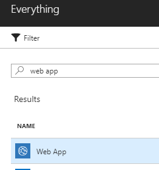

* Give the app a name to indicate the first of two sites that are going to be created e.g. \<your initials\>site1.azurewebsites.net

* Create a new app service plan that is at least a Basic instance to support custom domains and SSL certificates.

    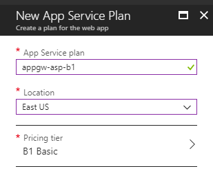

    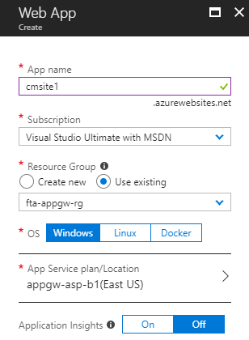

* Once the site has been created, create a second site using the same app service plan and the site name to indicate the second of two sites e.g. \<your initials\>site2.azurewebsites.net.

* Open the Azure portal to the first site. In the menu items, navigate to **App Service Editor** under *Development Tools* and then select **Go**.

* Select the **hostingstart.html** page and modify the following block of HTML code
    ```html
    <div class="bodyHeadline">Your App Service app is up and running</div>
    ```
    to 
    ```html
    <div class="bodyHeadline">Site 1 is up and running</div>
    ```

    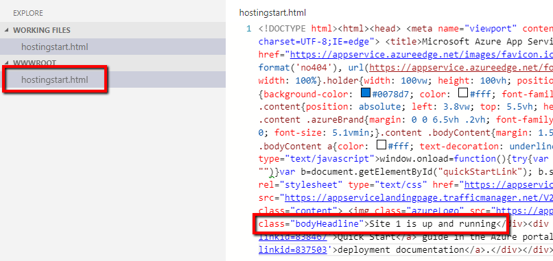

* Close the editor page and navigate to the site url and you should see the modified text.

    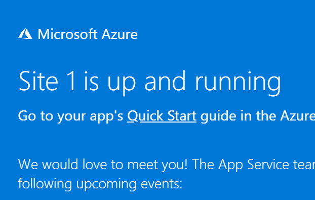

* Do the same for the second site and refer to it as **Site 2**.

### Setup Custom Domains

> Note: This process will be specific to the domain registrar you currently use.

We will need 2 subdomains that are indicative of the two sites we created such as site1.customdomain.com and site2.customdomain.com.

Create records in your registrar with the following values (changing to use your actual names)

| Record Type | Host Name | Value |
| ----------- | --------- | ----- |
| TXT | awverify.subdomain1 | site1.azurewebsites.net |
| TXT | awverify.subdomain2 | site2.azurewebsites.net |

* Once your records are configured, open the first app service in the Azure portal.

* In the menu options, navigate to **Custom domains** under *Settings*. Click **Add hostname**.

    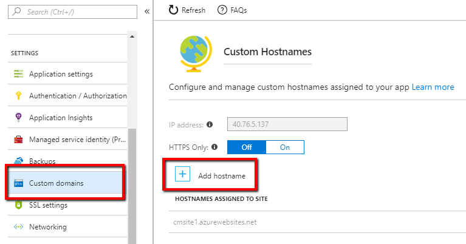

* Provide the fully qualified domain name to the record you just created e.g. site1.customdomain.com. Click **Validate**.

* Once the validation is complete, you should see the verification that the hostname is available and that you own the domain. Click **Add hostname**

    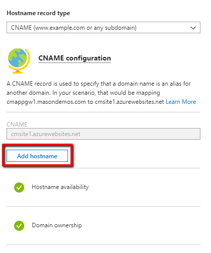

* Repeat this process for the second app service site.

### Configure SSL

* From the Azure portal, navigate to the first site in the Azure portal.

* In the menu options, navigate to **SSL Settings** under *Settings*. Under *Certificates*, click **Upload certificate**.

    

* In the **Add Certificate** blade, upload the pfx file created earlier and provide its password. Click **Upload**.

* Click **Add binding** under *SSL Bindings*.

    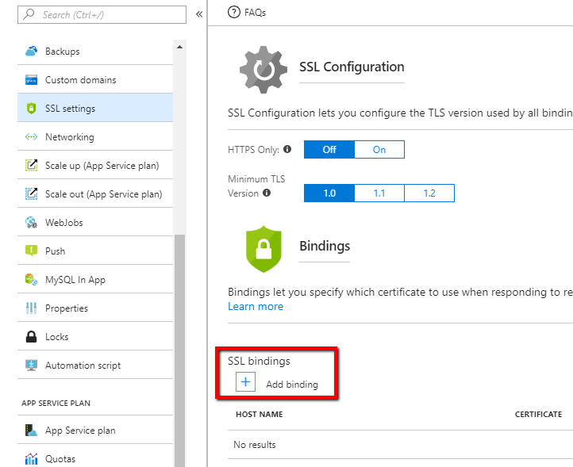

* In the **Add SSL Binding** blade, select the custom hostname and certificate you just uploaded. Click **Add binding**.

* Add a binding to the second app service as well. This time, since we used a wildcard certificate, there is no need to upload the certificate to this app. You can leverage the existing certificate already uploaded.

## Create Application Gateway

* Follow the steps to [create an application gateway](https://docs.microsoft.com/en-us/azure/application-gateway/application-gateway-create-gateway-portal#create-an-application-gateway)

    * The gateway can be deployed into the same resource group the app services are using.
    * You can use any name for the gateway such as webapp-appgw.
    * Change the tier to **WAF** keep the SKU size at least **Medium** so we can enable the WAF later on.
    * For this walkthrough, you can also scale down the instance count to 1.
    * In the settings, create a virtual network to hold the gateway and provide a name to use for DNS such as \<your initials\>appgw

    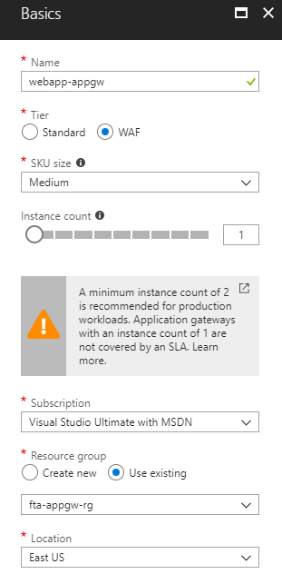

    

### Setup Custom Domains

> Note: This process will be specific to the domain registrar you currently use.

For each of the two subdomains that we created earlier, we will need additional records to point to the application gateway URL.

Create records in your registrar with the following values (changing to use your actual names and the dns of your gateway)

| Record Type | Host Name | Value |
| ----------- | --------- | ----- |
| CNAME | subdomain1 | appgw.eastus.cloudapp.azure.com |
| CNAME | subdomain2 | appgw.eastus.cloudapp.azure.com |

### Configure Sites for HTTP

* Open the application gateway from the Azure portal. Navigate to **Backend pools** and click **Add**.

    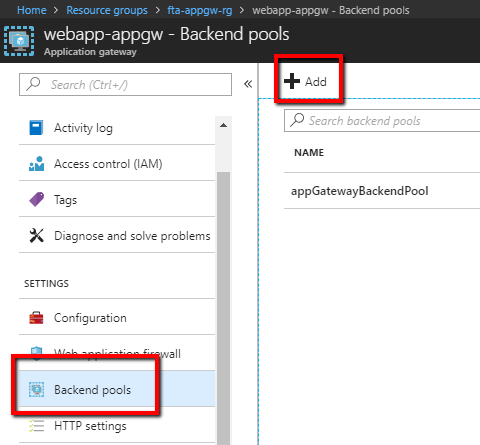

* In the **Add Backend Pool** blade, give it the name **site1BackendPool** and provide the FQDN to the azurewebsites.net instance, e.g. site1.azurewebsites.net.

    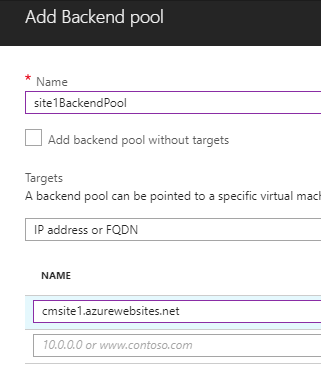

* Repeat this for site 2.

* Navigate to **Health probes** from the Azure portal and click **Add**. Fill out the following details:
    * Name: **site1HttpProbe**
    * Protocol: **HTTP**
    * Host: **site1.customdomain.com** (adjust for your site)
    * Path: **/**
    * All other settings: leave as default

* Create a second probe for your other site.

* Navigate to **HTTP settings** from the Azure portal and click **Add**. Fill out the following details:
    * Name: **site1BackendHttpSetting**
    * Cookie based affinity: **Disabled**
    * Connection draining: **Disabled**
    * Protocol: **HTTP**
    * Port: **80**
    * Use custom probe: **Enable** and select the site1 probe.

* Create a second setting for your other site.

* Navigate to **Listeners** from the Azure portal and click **Multi-site**. Fill out the following details:
    * Name: **site1HttpListener**
    * Frontend IP configuratinon: **appGatewayFrontendIP**
    * Frontend port: **appGatewayFrontendPort (80)**
    * Hostname: **site1.customdomain.com** (adjust for your site)
    * Protocol: **HTTP**

* Create a second listener for your other site.

* Navigate to **Rules** from the Azure portal and click **Basic**. Fill out the following details:
    * Name: **site1HttpRule**
    * Listener: **site1HttpListener**
    * Backend pool: **site1BackendPool**
    * HTTP setting: **site1BackendHttpSetting**

* Create a second rule for the second site.

* We need to cleanup resources that were created by default, so we will need to delete the default created *rule1*.

* Under listeners, we need to delete the default *appGatewayHttpListener*.

* Under Http settings, we need to delete the default *appGatewayBackendHttpSettings*.

* Finally, under Backend pools, we need to delete the *appGatewayBackendPool*.

* Once the default settings are removed, you can validate that the application gateway is working by testing each site individually e.g. http://site1.customdomain.com and http://site2.customdomain.com. You should see the default Azure website welcome page indicating App 1 or App 2 respectively.

### Configure Sites for HTTPs

* Navigate to **Health probes** from the Azure portal and click **Add**. Fill out the following details:
    * Name: **site1HttpsProbe**
    * Protocol: **HTTPS**
    * Host: **site1.customdomain.com** (adjust for your site)
    * Path: **/**
    * All other settings: leave as default

* Create a second probe for your other site.

* Navigate to **HTTP settings** from the Azure portal and click **Add**. Fill out the following details:
    * Name: **site1BackendHttpsSetting**
    * Cookie based affinity: **Disabled**
    * Connection draining: **Disabled**
    * Protocol: **HTTPS**
    * Port: **443**
    * Backend authentication certificates
        * Name: **wildcardtestcert-public**
        * Upload CER certificate: *Provide the path to the .CER certificate file*
    * Use custom probe: **Enable** and select the site1 https probe.

* Create a second setting for your other site. For the certificate, choose **Select existing** and point it at the certificate previously uploaded.

* Navigate to **Listeners** from the Azure portal and click **Multi-site**. Fill out the following details:
    * Name: **site1HttpsListener**
    * Frontend IP configuratinon: **appGatewayFrontendIP**
    * Frontend port: *Click **New***
        * Name: **appGatewayFrontendHttpsPort**
        * Port: **443**
    * Hostname: **site1.customdomain.com** (adjust for your site)
    * Protocol: **HTTPS**
    * Certificate
        * **New**
        * Upload PFX certificate: *Provide the path to the .PFX certificate file*
        * Name: **wildcardtestcert-private**
        * Password: *Provide the password used to create the certificate file*

* Create a second listener for your other site. Make sure to use the new frontend port that was created and for the certificate, configure it to use the private certificate just created.

* Navigate to **Rules** from the Azure portal and click **Basic**. Fill out the following details:
    * Name: **site1HttpsRule**
    * Listener: **site1HttpsListener**
    * Backend pool: **site1BackendPool**
    * HTTP setting: **site1BackendHttpsSetting**

* Create a second rule for the second site.

* Validate you can access the websites over an https connection. If using a self-signed certificate, you can ignore certificate warnings.

* In the **Rules** section, select the **site1HttpRule** and click **Edit**. Make the following changes:
    * Configure redirection: **Enabled**
    * Redirection type: **Permanent**
    * Redirection target: **Listener**
    * Target listener: **site1HttpsListener**
    * Include query string: **Enabled**
    * Include path: **Enabled**

* Update the **site2HttpRule** with similar changes.

* Validate the http to https redirection is working by navigating to http://site1.customdomain.com and you should see that you will be redirected now to the https version of the site.

* We can now remove the previously created http health probes and backend http settings. Make sure to leave the https configurations unchanged.

### Restrict App Service IP Address

Optionally, we can restrict the IP addresses that we will allow access to the web apps to only accept traffic coming from the IP of the application gateway.

* Navigate to the **Overview** section of the application gateway. Look for the **Frontend public IP address** and save the IP address used by the application gateway.

    

* Open the first web app from the Azure portal. Navigate to the **Networking** menu and then click on **Configure IP restrictions**.

    

* Click **Add rule** and provide the IP address of your application gateway. Leave the **Subnet Mask** field empty. Click **Add rule**.

* Configure the second web app in a similar fashion.

* Try navigating to the azurewebsites.net specific instance e.g. https://site1.azurewebsites.net and you should see an error about trying to access the site from an invalid IP address. Validate that you can still access the site through the custom domain.

### Configure Web Application Firewall

If we followed the steps above during the creation of the application gateway, the WAF will be enabled in *detection* mode. We can configure the WAF to start reporting any potential attacks. In this case we will use a simple storage account to hold the data.

* [Create a storage account](https://docs.microsoft.com/en-us/azure/storage/common/storage-create-storage-account#create-a-storage-account) and place it in the same resource group as the application gateway.

* From the application gateway blade in the Azure portal, click the **Diagnostics logs** menu under the **Monitoring** section.

* Click the link that says **Turn on diagnostics**.

* Under diagnostics settings, fill out the following details
    * *Name*: **waf-diagnostics**
    * *Archive to a storage account*: Configure it to the storage account just created.
    * *Logs*: Check **ApplicationGatewayFirewallLog**

    Click **Save**

    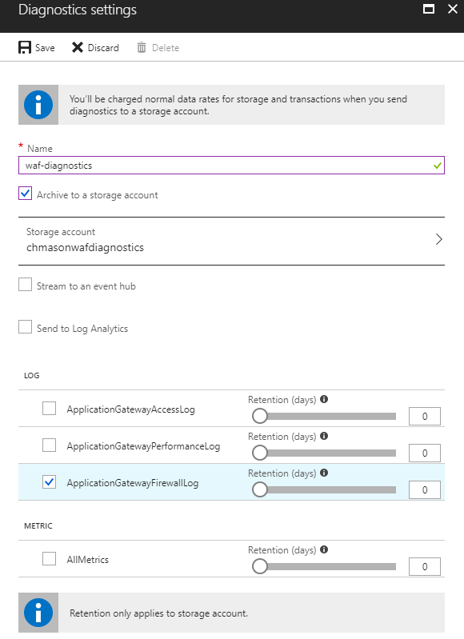

* We can validate that the WAF will detect potential attacks by appending an improper query string to the url e.g. https://site1.customdomain.com/?' and see that the website will still load.

* Open the storage account in the Azure portal and navigate to the blobs view. You will see a container with the name **insights-logs-applicationgatewayfirewalllog**. Open this container and navigate down the folder structure until you get to the *PT1H.json* file. Either download the file or edit it in the browser. You should see a record in there along the lines of:
    ```json
    {
        "operationName": "ApplicationGatewayFirewall",
        "category": "ApplicationGatewayFirewallLog",
        "properties": {
            "instanceId": "ApplicationGatewayRole_IN_0",
            "clientPort": "0",
            "requestUri": "/?'",
            "ruleSetType": "OWASP",
            "ruleSetVersion": "3.0",
            "ruleId": "942110",
            "message": "SQL Injection Attack: Common Injection Testing Detected",
            "action": "Detected",
            "site": "Global",
            "details": {
                "message": "Warning. Pattern match \"(^[\\\"'`;]+|[\\\"'`]+$)\" at ARGS_NAMES:'.",
                "data": "Matched Data: ' found within ARGS_NAMES:': '",
                "file": "rules/REQUEST-942-APPLICATION-ATTACK-SQLI.conf",
                "line": "490"
            }
        }
    }
    ```
    This is showing that the firewall is detecting a possible SQL injection attack being performed against the site.

* From the application gateway blade in the Azure portal, click the **Web application firewall** menu under the **Settings** section. Click to switch the *Firewall mode* from **Detection** to **Prevention** and click **Save**.

* Once the save completes, navigate to the url above with the improper query string. You should now get a 403 - Forbidden message indicating that this query string is now blocked.