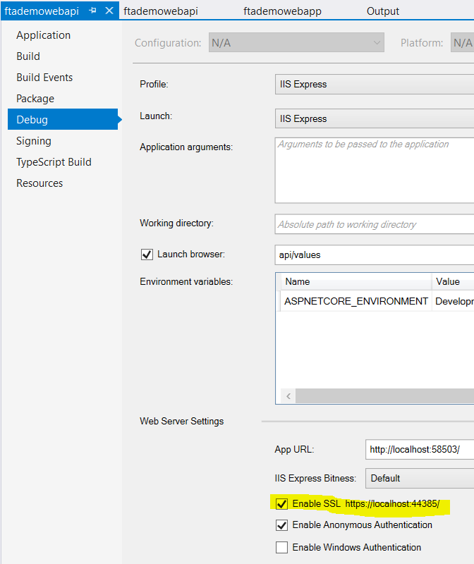
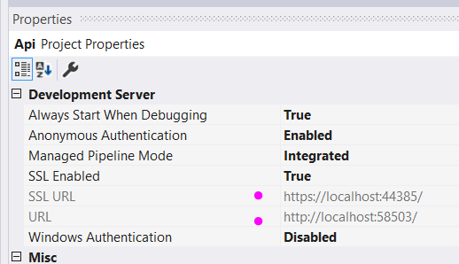
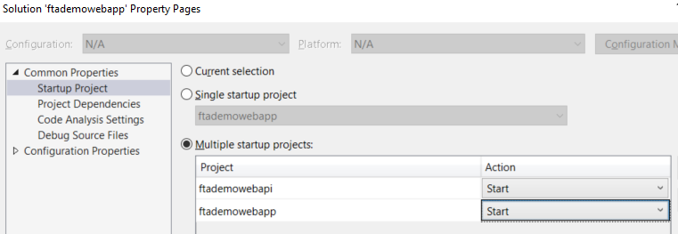
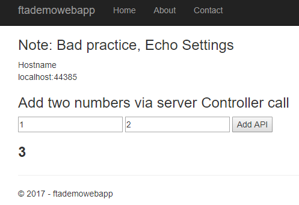
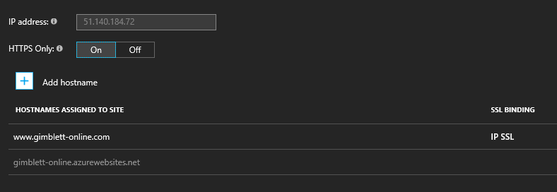
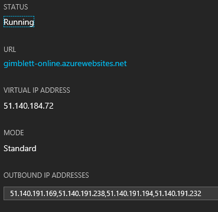
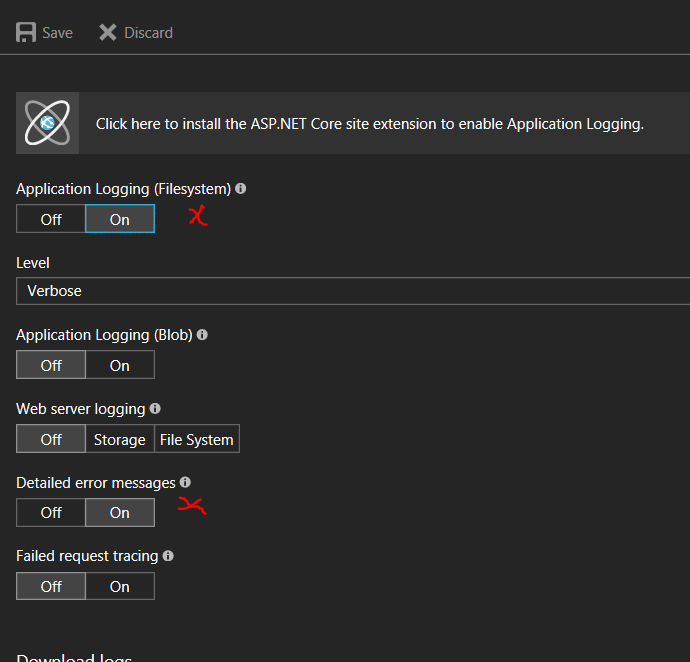

# Web Aps Demo

### Objectives

Learn the common **features** of Azure Web Apps Suite
* Web Apps
* Api Apps

### Agenda 

* Create the Demo (asp net core or .net full)
* Web App Plan
* Deploying to Azure
    * Visual Studio
    * (optional) GIT integration CI/CD 
    * (optional) Build & Release through VSTS / CI/CD Preview blade
* App settings
* Cross Origin Domain requests (CORS)
* Scale up, scale out
* (optional) Custom domains + IP SSL / SNI SSL
* Deployment slots & staging changes
* Sticky settings
* Application Insights integration
* (optional) Managed Service Identity (MSI)
* KUDU
    * Site Extensions
    * WebJobs
* Adding Swagger support to the API

> [!NOTE] 
> * I've not including the authorization functionality, whilst this is powerful and you may wish to include it, the implication can be that the customer doesn't code this into the app but relies on App Service to provide the functionality.
>
> * The Chrome Browser is used in some of the screen grabs here to demo what's happening behind the scenes (surface ajax errors for example). However the developer tools in **Edge** are just as effective and Edge could easily be used in a customer walk-through.

### To walk through all features you will need access to:
* An Azure Subscription with credit
* A registered domain (for the domains feature)
* An SSL certificate associated with the domain (for IP and SNI SSL features) - Or you can use ["Lets encrypt"](https://blogs.msdn.microsoft.com/mihansen/2018/01/25/azure-web-app-with-lets-encrypt-certificate-powershell-automation/)
* Visual Studio 2017 latest
* Create the demo projects in either .net full or Dot NET & ASP NET Core
    * For .net core ensure you have the latest VS release (>15.5) [Ensure you've checked here for more complete list of prerequisites](https://docs.microsoft.com/en-us/dotnet/core/windows-prerequisites?tabs=netcore2x#prerequisites-with-visual-studio-2017)

Visual Studio 2017 is preferred because of the ease of local debugging and publish.

> [!NOTE] The instructions for setting up the demo will follow two tracks, one for .net full and one for .net core. Follow one of the other

## **Demo - Creating the example**

### **1. Azure**

i. Create A new Resource group *"fta-webappdemo-rg"*, make the location in *West Europe*.  

Next add a new *Win OS Web* Web App *"ftademo-webapp"* to the resource group, consider *"fta-wap"* for the App Plan name and "Standard S1" as the SKU. 

When the plan is created add the API app under the plan: Consider *"ftademo-webapi"*.

Web Apps are usually really quick to provision - so this should take no more than 1 minute. 

> [!NOTE] If you want to demo App Insights - you can turn it on for both the web and webapi apps

For an overview of Hosting plans see [here](https://docs.microsoft.com/en-us/azure/app-service/azure-web-sites-web-hosting-plans-in-depth-overview)
* Cover the basics of scale up (bigger workers) and scale out (more instances) and point out that multiple apps can be hosted sharing the plan.
* Scale out can be automated, for the basics of [auto-scale see here](https://docs.microsoft.com/en-us/azure/architecture/best-practices/auto-scaling)

Your Azure resources:


> [!NOTE] 
> More information on the underlying Web App Architecture can be found [**here in this MSDN magazine article**](https://msdn.microsoft.com/en-us/magazine/mt793270.aspx) - published by Yochay and Stefan of the Web App Suite product group. The article describes some considerations for scaling and exactly how the inbound and outbound IP addressing work.

### **2. Back on the desktop, open VS and create two new ASP NET Core projects.**

*NetCore*
* The first project will represent the web front end. This can be based on the standard "ASP NET Core Web Application" template- choose the "Web Application" flavour (**not MVC**).

* The second project should be added to the same solution and this will represent the API. Again, this project can be based on the standard "ASP NET Core Web Application" template, this time choose the "Web API" flavour.

*NetFull*
* The first project will represent the web front end. This can be based on the standard "web->Asp net web application (.net framework)" template- choose the "MVC" flavour. Check "Authentication" is set to "None".

* The second project should be added to the same solution and this will represent the API. Again, this project can be based on the standard "web->Asp net web application (.net framework)" template, this time choose the "Web API" flavour.

The names don't matter too much, but keep a note as the Web App will need to be configured to call the API app.

Check the solution builds.

For consistency with the sites created under the WAP above, consider "ftademowebapp" and "ftademowebapi".

> [!NOTE] 
> Dont enable docker unless you plan to demo docker features later.
>
> Dont enable authentication - this allows you to demo the Web App authentication feature later.
>
> The demo projects keep the amount of coding and the complexity to an absolute minimum - the focus of the demos is the App Suite functionality and not the application itself.
>
> We'll use IISExpress to host (this still applies if you chose to create the demo using netcore) and NOT the ASP NET CORE webhost - the reason for this is that SSL is more straightforward to configure locally on IISExpress and it serves this purpose.

### **3. Setting up the projects in Visual Studio**


*NetCore*

i. Enable Https for debugging in VS on the API project properties page -> debug tab. For ASP NET Core in VS this modifies the vs-specific apphost config and launchsettings




*NetFull*

i. Enable SSL for debugging in VS on the API project properties page. 



> [!NOTE] Make a note of the port numbers in the project for http and https we'll use these values in the remainder of the document. If your VS is different make a note of yours now (the IISExpress SSL port range in VS2017 is 44300-44399) 
>
> HTTPS **``localhost:44385``**
> 
> HTTP **``localhost:58503``**
>

*NetFull and NetCore*

ii. Set VS to start both projects at the same time - from the solution file in "solution explorer" use right click context menu ->solution properties. Select both projects for "start" action, under the "Multiple StartUp Projects" radio option.



For the next step continue with EITHER the *NetCore* OR *NetFull*

### **4. *NetCore:* Adding the example functionality**

i. Adding the HTML

Replace the index view existing content with the following code snippet:
```
@page
@model IndexModel;
@{
    ViewData["Title"] = "FTA Calculator Home Page";
}

<div>
    <h3>Note: Bad practice, Echo Settings</h3>
    @Html.DisplayForModel()
</div>
<h3>Add two numbers via server Controller call</h3>
<div>
    <input id="a" type="text" />
    <input id="b" type="text" />
    <button id="cmdaddapi" data-hostname="@Model.Hostname">Add API</button>
    <h3><label id="r" /></h3>
</div>
```
ii. In the code behind, modify the code in the IndexModel class to match the example below.
```
// Add the API app endpoint Hostname property and ensure it's populated from app settings

    using Microsoft.Extensions.Configuration;

    public class IndexModel : PageModel
    {
        public string Hostname { get; set; }

        private IConfiguration _configuration;

        public IndexModel(IConfiguration configuration)
        {
            _configuration = configuration;
        }

        public void OnGet()
        {
            Hostname = _configuration["Hostname"];
        }
    }

```

iii. Add the following "Hostname" setting to the "appsettings.json" settings file as a sibling to "logging", which should already exist. 
Ensure you amend the correct port, based on your Visual Studio settings -> from the API project -> debug tab -> SSL setting (as configured above)

**``"Hostname": "localhost:44385"``**

> [!NOTE]
> The following notes apply to **ASP NET CORE**
>
> Azure Web Apps config is served via environment variables. When you’re using an **ASP NET Core** configuration class, under the covers the ``appsettings`` content is loaded first, with settings from environment variables added last. 
>
> In the *dev environment* there are no ENV vars set (by default), so the ``appettings`` configuration is used.
>
> But, when you deploy the app into Web apps (and keep in mind there is no ``web.config`` file here) the ``appsettings`` you specify are converted to ENV vars.
>
> What does all this mean? 
>
> At runtime on the Web App, the values from the ENV vars will be used because by convention the *LAST* settings to be loaded are used by the ASP NET Core runtime! 


iv. Adding the JavaScript Action - create a new file under "wwwroot/js" called "index.js" and add:
```
$('#cmdaddapi').click(function () {
    var host=$('#cmdaddapi').data('hostname');
    var aval = $("#a").val();
    var bval = $("#b").val();
    var url = "https://" + host + "/api/calculator/add";
    $.get(url, { a: aval, b: bval }, function (data) {
        $("#r").html(data);
    });
})
```

v. Finally, add the following line to "_layout.cshtml" under the line for ``@RenderSection("Scripts")``

``` 
<script type="text/javascript" src="~/js/index.js"></script>

```

This ensure the JS gets added to the page via the layout.

**vi. Next, switch to the API project.**

Using Visual Studio - create a new, empty, API Controller called "CalculatorController" and add the following simple *HTTP GET* action to it:

```
    [HttpGet("Add")]
    public int Get(int a, int b) {
        return a+b;
    }

```
vii. The last step in the API project is to allow for CORS (Cross origin domain calls) for the local development environment. Add the following line 
``app.UseCors(builder => builder.WithOrigins("http://localhost:58503")); `` to the ``startup.cs`` ``configure()`` method, under the use developer exception page line. 

> [NOTE!] Ensure you have coded the correct port for you **web app** (right click project properties -> debug tab -> and look for the iis express port - in our example its 58503)

This is what the ``Configure`` code should look like:
```
        public void Configure(IApplicationBuilder app, IHostingEnvironment env)
        {
            if (env.IsDevelopment())
            {
                app.UseDeveloperExceptionPage();

                app.UseCors(builder => builder.WithOrigins("http://localhost:58503"));
            }

            app.UseMvc();
        }
```

Optionally you can **remove** the default *"ValuesController"* from the API project.

viii. Now run the projects through the Visual Studio debugger and in the front end test the callback (add a couple of numbers, go on, live life on the edge...)

You should now have a simple front end browser app using JavaScript to call back to a Web API and return the sum of two values.

> [!Note] If you wish to test the API independently the JavaScript will call through using the following URL+QueryString `` https://localhost:44385/api/calculator/add?a=2&b=3`` 
> (Again, remember to check the port used in this example and replace with your own if the values differ. In our example here the SSL port for IISExpress is 44385)
>

The end result through the front end should be:

 

> [!Warning] 
> Highlight the fact you should never echo settings to the UI in real apps. 
>
> This demo favours simplicity over good practice. It's a demo after all!

### **4. *NetFull:* Adding the example functionality**

i. Adding the HTML

Replace the index views existing content with the following code snippet. With mind that using ViewBag like this is lazy and not recommended for real (using View Model would be preferred):
```
@{
    ViewData["Title"] = "FTA Calculator Home Page";
}

<div>
    <h3>Note: Bad practice, Echo Settings</h3>
    @ViewBag.Message
</div>
<h3>Add two numbers via server Controller call</h3>
<div>
    <input id="a" type="text" />
    <input id="b" type="text" />
    <button id="cmdaddapi" data-hostname="@ViewBag.Message">Add API</button>
    <h3><label id="r" /></h3>
</div>
```
ii. In Home Controller file, find the Index action and modify the action method code to match the example below.
This requires a reference to the System.Configuration namespace (reads from web.config)
```
        public ActionResult Index()
        {
            ViewBag.Message = System.Configuration.ConfigurationManager.AppSettings["Hostname"];
            return View();
        }

```

iii. Add the following "Hostname" App setting to the "web.config" AppSettings section. Ensure you amend the correct port, based on your Visual Studio settings -> from the API project -> debug tab -> SSL setting (as configured above)

**``<add key="Hostname" value="localhost:44385"/>``**

iv. Adding the JavaScript  - create a new file under "Scripts" folder called "home.js" and add:
```
$('#cmdaddapi').click(function () {
    var host=$('#cmdaddapi').data('hostname');
    var aval = $("#a").val();
    var bval = $("#b").val();
    var url = "https://" + host + "/calculator/add";
    $.get(url, { a: aval, b: bval }, function (data) {
        $("#r").html(data);
    });
})
```
v. Finally, add the following line to "_Layout.cshtml" under the line for ``@RenderSection("Scripts")``

``` 
<script type="text/javascript" src="~/Scripts/home.js"></script>

```

This ensure the JS gets added to the page via the layout.

**vi. Next, switch to the API project.**

Using Visual Studio - create a new, empty, API Controller called "CalculatorController" and add the following simple *HTTP GET* action to it:

```
    public class CalculatorController : Controller
    {
        // GET: Calculator
        [HttpGet]
        public int Add(int a , int b)
        {
            return a+b;
        }
    }

```

You can test by starting the projects and using the following URL:
https://localhost:44385/calculator/add?a=2&b=3 

vii. The last step in the API project is to allow for CORS (Cross origin domain calls) for the local development environment. Add the following line. 

The quickest and easiest way to do this reliably is to set the headers on web.config of the API project (the webapi cors nuget package can be a serious pain to get working correctly)
```
     <httpProtocol>
      <customHeaders>
        <add name="Access-Control-Allow-Origin" value="http://localhost:58503" />
        <add name="Access-Control-Allow-Headers" value="Content-Type" />
      </customHeaders>
    </httpProtocol>
    

```

Ensure the port number is correct and there's no trailing "/".
This is all that's required to enable cors for development.


## **Demo - Using the example to explore Web App features**

### **5. Deploying to Azure**

The first step is to join the dots so far and demo the locally tested web app + web api working together in Azure. 

I would note to the customer: In reality customers seldom use Visual Studio to deploy in this way - and certainly this isn't a scenario that's useful outside of stage-demo's and initial proofs-of-concepts and learning.
But, for the purposes of this *demo* it's a quick and neat way to get started.

> [NOTE!] Check your credentials in Visual Studio and that you have the correct credentials for your REPO - i.e. if you're using a live account as the owner for Visual Studio Team Services, ensure the live credential is used or add your corp. account to the team project. A common integration error is because multiple accounts are used and the wrong account is defaulted for Source control integration.

i. Right click the solution in Visual Studio and "add to source control" which should (if your configured for git by default) add the solution and both projects to a **local** git repo:

 

You should then **sync** this and let the tooling guide to to creating a **remote** repo target

 

Right Click -> **Publish** (on each project) creating a *deployment profile* pointing to the subscription, resource group, WAP and site (hit "select existing") created in the steps above.

You don't have to actually publish the app unless you want to. Why...?

At this point you can use the updated VS tooling to add the project to "Continuous Delivery" - like this:

 

Or, you can go to VSTS and set up Build and Release definitions using the improved and more productive UI there. 

My view is that customers are better off being led through setting this up in the VSTS portal - which makes a superb job of guiding you through Build & Release definition creation.

The script invoked by VS behind the scenes (at the time of writing) was unable to distinguish the projects being used and created a build encompassing both (solution level). 
It takes some effort and a little time to unpick this by editing the Build and release definitions manually once they've been created - through VSTS UI.

(It should be noted this appears to be the use of an overarching solution file - at the time of writing. But, many customers use solution files.)

I also experienced a permissions issue when the underlying script needed to create an AAD ServicePrincipal/AAD-App for VSTS to utilise my Web App resource in Azure. This is easy to fix, but the broken reference in VSTS cannot then be removed through the UI (again at the time of writing, which is probably a bug).

You should note that by default an auto-magically (not manually) provisioned AAD ServicePrincipal will have the App permission added against the actual web App resource and not the Web App Plan or ResourceGroup (which is good).

If you do choose to lead the customer through VSTS build + release definition creation (which should be a preference, but extends the scope considerably) then you will find the Azure Web App UI is intelligent enough to "discover" the VSTS release pipeline the first time a build triggers a release. This is a really neat addition.

Finally you should test the deployment: 

 

As the Api doesn't have HTML to render you can test the deployed version using a modified version of the local URL: ``https://ftademo-webapi.azurewebsites.net/api/calculator/add?a=2&b=3 ``

If you're showing-off the VSTS CD pipeline - then go ahead and make a simple change to the index view of the web app. Make a change to the controller action method for the calculator API as well, adding +1 to the action method a+b sum is enough to demo a visible change. Be aware that if you're using VSTS HostedAgent (which is the default) then this is something you may want to go back to after approx. ~5mins.

### **6. Hey, the deployed calculator UI can't call the calculator service - why doesn't it work?**

At this point, if the customer is new to Web App Suite - you can ask them to tell you why!

A simple update of the configuration *hostname is required - this practically demos how the AppSettings (remember these end up as Env vars) work. Note that you can deploy a web app with the settings override, for example in the [Web Sites ARM template](https://docs.microsoft.com/en-us/azure/templates/microsoft.web/sites). 

Open the web site in chrome and show the connection refused error in the developer tools.


### **7. App Settings**

Add the following AppSetting to the deployed web app via the portal UI -> Settings -> Application settings -> "Application settings" (section)
Key: Value
```
"Hostname": "ftademo-webapi.azurewebsites.net"
```
Scroll to the top of the Azure Portal Blade and hit "Save".

Refresh the browser showing the web app, after a short pause, the echo setting should have changed


At this point you can try the calculator function again, do this with the developer tools window still open.

It fails again, but this time with:


### **8. CORS**

This is super easy to fix, navigate to the deployed API web app in the Azure portal, hit "API" -> "CORS".
In the "Allowed Origins" box type "https://ftademo-webapp.azurewebsites.net" - don't forget to "Save".

Go back to the browser and the web app, hit refresh to reload the page, and try the calculator again.

This time is works.

>[!NOTE] Web App CORS should override any CORS you provide in the App Code. There seems to be some issues with netFX WebAPI CORS. In my example the Nuget cors package for WebAPI didn't work and neither did WebApp Cors once deployed to Azure. Setting cors in web.config did work for both IISExpress and WebApp. *Requires more investigation, this is an issue a lot of users have looking at SO*

### **9. Scale up, scale out**

Navigate to the app service plan and show
* Scale up (App Service plan) - compute tier
* Scale out (App Service plan) - instances

Mention to the customer:
* [All apps deployed under a plan share the same compute resources](https://docs.microsoft.com/en-us/azure/app-service/azure-web-sites-web-hosting-plans-in-depth-overview#should-i-put-an-app-in-a-new-plan-or-an-existing-plan) - this includes any "slots", web-jobs or functions deployed under the plan
* Two or more instances (scale out) are required for HA
* **Shared** compute, "Free" and "Shared" base tiers are not recommended for production workloads
* **Isolated** sku (aka "ASE") - recommended for workloads that need additional security (for example a workload processing payments that needs to meet PCI compliance, or where the customer needs more control over the networking) or significant scale.
* **Consumption** aka "serverless"- for functions only at the time of writing. 

Reference the Web app plan overview document [here.](https://docs.microsoft.com/en-us/azure/app-service/azure-web-sites-web-hosting-plans-in-depth-overview)

### **10. (optional) Adding your own domain and IP/SNI SSL**

> [!Note] The screen grabs show an earlier demo using a private domain so the "*.azurewebsites.net" is inconsistent.

i. [Upload the SSL certificate following this guide](https://docs.microsoft.com/en-gb/azure/app-service/app-service-web-tutorial-custom-ssl)


ii. [Map the custom domain following this guide](https://docs.microsoft.com/en-gb/azure/app-service/app-service-web-tutorial-custom-domain). Don't forget to amend the API App CORS settings to include the new Domain name source.



Browse to the website properties to see the fixed inbound url AND the outbound addresses for the current Plan. The outbound range is NOT static. [Announcement here](https://blogs.msdn.microsoft.com/waws/2017/02/01/how-do-i-determine-the-outbound-ip-addresses-of-my-azure-app-service/).




> [!NOTE] 
> **Important: The web app inbound IP + SSL binding**
> 
> The inbound IP provided is shared, but won't change unless the Web App plan moves to another stamp (scale unit). 
> Outbound IPs can change when you change pricing tier, but you can get all possible outbound IPs for the entire scale unit in resource explorer by looking at the web app's "possibleOutboundIPAddresses" field. So white-listing these will guard you from any IP change including when scaling to a different pricing tier. And in practice you should never be moved from one scale unit to another inside the same Azure region.
>
> Scaling up or down should not change either the shared IP address or the dedicated IP address as your web app will remain in the same stamp (scale unit). If the plan does move to another stamp then the IP addresses will change. 
>
> For a dedicated IP address use IP Based SSL binding.The IP may still change if you delete the SSL binding and recreate it. 
> If you update only the certificate but do not delete the IP Based SSL binding then the dedicated IP address will remain the same.
>
> Planned maintenance across app service should also not cause your workload to move stamps as the updates should cause your workload to be shifted across update domains within a stamp. [See here](https://blogs.msdn.microsoft.com/appserviceteam/2018/01/18/demystifying-the-magic-behind-app-service-os-updates/)
>
> Recommend: Where one or more SSL certificates are required (for example multiple domains not covered on a wildcard) bind one domain to IP SSL and the remainder as SNI. [Refer to this FAQ](https://docs.microsoft.com/en-us/azure/app-service/app-service-web-configuration-and-management-faq#how-do-i-get-a-reserved-or-dedicated-inbound-ip-address-for-my-web-app) and points above, to ensure the inbound IP is fixed reliably. Check the cost for using SSL IP with the Azure calculator. 
>
> Ensure the customer understands the difference between IP based SSL (older) and SNI SSL (newer).
>
> Finally, it is worth noting the outbound IP's allocated should not change whilst the web app plan remains on the same stamp. However, today, you cannot reserve a dedicated outbound IP address. For customers wishing to have more control over the networking they can opt for the more powerful, but more expensive, second generation App Service Environment (ASEv2).

### **11. Deployment slots, staging changes and Sticky settings**

Setting up a staging slot for the web app and the API is also a good way to demonstrate sticky settings. The "Hostname" setting is the perfect sticky setting example.

Create a slot for the Web App called "Staging" - note that "staging" gets appended to the site name for the slot:


Navigate to the "Staging" Web App, amend the *existing* "Hostname" setting "ftademo-webapi.azurewebsites.net" for the to point to the "Staging" version of the API "ftademo-webapi-staging.azurewebsites.net", make this "Sticky" (aka slot specific).
Navigate back up and hit "Save":


Create a slot for the Web API called "Staging" - don't forget to update the CORS setting for the API app to allow the "staging" web app:


View the two apps and their slot apps under the Web App Plan -> Apps


> [!NOTE] Slots create a fully-fledged instance which consumes resources allocated in your plan. E.g. [it is not a good idea to load test a deployment slot.](https://cmatskas.com/introduction-azure-functions-deployment-slots/)

Run the App in staging.

Then, make a demonstrable change in code on each project, commit, sync and publish

* (optional) edit each (VSTS) release definition to deploy to "Staging" slot. It is a 10second change to each Release definition. 
Wait for it to be deployed to staging, allow ~5mins for HostedAgent deployment. Progress can be monitored through the VSTS UI.

Note: As soon as the first successful VSTS release to staging occurs it will be visible when you hit the staging app and go to the CI/CD preview.


* Otherwise, use the standard CI/CD to pick up the commit, or publish each project to "Staging" manually.

* Demo the staging slot change.

* Then use the SWAP facility [Portal] to promote the staging deployment to production for the API app followed by the Web App.

* Demo the change from the "production" web app.

[Mention Slot features](https://docs.microsoft.com/en-us/azure/app-service/web-sites-staged-publishing#swap-with-preview-multi-phase-swap)
* Multiphase swap (swap with preview)
* Autoswap
* Rollback
* custom warmup
* [A+B Testing](https://azure.microsoft.com/en-gb/resources/videos/introduction-to-azure-websites-testing-in-production-with-galin-iliev/)

See [here](https://blogs.msdn.microsoft.com/mvpawardprogram/2017/05/16/deploy-app-azure-app-service/) for best practices for deployment slots.
Draw the customers attention to the **"Peforming a swap"** section.

### **13. Application Insights**

What is Application Insights?

App Insights is Microsofts Application-Performance-Monitoring solution (APM) and competes with leading APM vendors in the browser+webapp space such as NewRelic and AppDynamics.

Application Insights can be used in two ways
1. As an SDK
2. With a profiler
App Insights is most effective when used with both (this will happen by default when deployed with Web Apps hosted application).

A big value proposition and selling point of Application Insights is its modularisation and the ability of the end user to extend the API and provide heavily customized or business specific metrics. So whilst App Insights is most useful out of the box for web apps, it can be extended to work with other types of application too.

Application Insights can be used without adding the SDK to your project code. To monitor websites already deployed on premises, use Application Insights Status Monitor. When hosting in Azure Web Apps a customer can get started with Application Insights  through a simple setting change. [Walk the customer through this document - make clear that however the app is hosted, the most value will be derived from installing the SDK into the project](https://docs.microsoft.com/en-us/azure/application-insights/app-insights-azure-web-apps#run-time-instrumentation-with-application-insights)

What can you do with Application Insights?

Application Insights and APM can be used to 
* Capture metric data
* Exceptions
* Application logging or tracing.
APM is critical for two reasons
1. It allows for proactive monitoring - you should be aware of a potential problem and be able to act on it, before your customers
2. Should significantly lower the time for operational root-cause-analysis which is critical to understanding and mitigating live application issues.

Side notes:
1. APM can also be utilised to capture underlying machine / compute metrics in certain scenarios to provide a "single pane of glass" for application health and operational monitoring
2. APM vendors often provide a synthetic-transaction service (outside-in-APM). Microsoft also provides such a service which probes deployed websites from different locations around the world. [Take the customer through this document](https://docs.microsoft.com/en-us/azure/application-insights/app-insights-monitor-web-app-availability)

#### Enabling App Insights

1. [Enable in the Azure portal](https://docs.microsoft.com/en-us/azure/application-insights/app-insights-dotnetcore-quick-start#enable-application-insights)
2. [Add the SDK using the VS tooling](https://docs.microsoft.com/en-us/azure/application-insights/app-insights-dotnetcore-quick-start#configure-app-insights-sdk) or [through Nuget for .net web apps](https://www.nuget.org/packages/Microsoft.ApplicationInsights.Web/)

You can send tracing / logging to app insights through System.Diagnostics namespace for dot net full framework and dot net core or you can add sinks to your existing logging framework (for example NLog or Log4Net) without code changes. 
Walk the customer through [this document](https://docs.microsoft.com/en-us/azure/application-insights/app-insights-asp-net-trace-logs)

#### Demo

App Insights data is correlated through an Instrumentation key. The instrumentation key represents the App Insights resource (or tenant). In most cases you would choose a resource per app to monitor.

* Add the AI ASP NET CORE package to the web calculator project
``Microsoft.ApplicationInsights.AspNetCore``

* If you didn't create an Application Insights resource when the web app was created, go ahead and add one to the resource group. Then make a note of the "instrumentation key" from the App Insights resource overview blade.

* Add the instrumentation key to the config which will allow you to send to App Insights when you locally debug as well as when you deploy to Azure

```
{
  "Logging": {
    "IncludeScopes": false,
    "LogLevel": {
      "Default": "Warning"
    }
  },
  "Url": "localhost:44385",
  "APPINSIGHTS_INSTRUMENTATIONKEY": "{your app insights key}"
}

```

* Open ``program.cs`` and configure the app insights SDK to log

``` 
    public static IWebHost BuildWebHost(string[] args) =>
            WebHost.CreateDefaultBuilder(args)
                .UseStartup<Startup>()
                  .ConfigureLogging((hostingContext, logging) =>
                  {
                      logging.AddConfiguration(hostingContext.Configuration.GetSection("Logging"));
                      logging.AddAzureWebAppDiagnostics();
                  })
                .Build();
    }

```

* For the purposes of demo remove the default error redirect. Open the ``startup.cs`` and modify the code from

```
    if (env.IsDevelopment())
    {
        app.UseBrowserLink();
        app.UseDeveloperExceptionPage();
    }
    else
    {
        app.UseExceptionHandler("/Error");
    }
```

To

```
    if (env.IsDevelopment())
    {
        app.UseBrowserLink();
        app.UseDeveloperExceptionPage();
    }
    else
    {
        app.UseExceptionHandler();
    }
```

* Demo injecting the logger into the ``HomeController`` alongside the configuration class to log a really useful message on each Index action invocation

```
        private ILogger _logger;

        public HomeController(IConfiguration configuration, ILogger<HomeController> logger)
        {
            _configuration = configuration;
            _logger = logger;
        }
        public IActionResult Index()
        {
            _logger.LogInformation("Hey! My useful Custom logging trace message!");

            return View(new ViewAppSettings {
                Url = _configuration["Url"]
            });
        }


```

Show the app insights config, turn on ``detailed errors`` for debugging (note it's not a good idea to leave this running in production scenarios - the same applies for example to IIS request execution tracing) and note that for ASP NET CORE an additional extension is required



Deploy the changes and go to App Insights resource and Demo:
* The captured metrics
* The captured Trace logging, system and custom trace event
* The live log streaming


### **14. (optional) Managed Service Identity (MSI)**

> [!WARNING] The MSI functionality is NOT supported for STAGING SLOTs at the time of writing.

The simplest way to show MSI functionality is to modify the web app to read a "secret" setting from a KeyVault resource trusted to the Managed Identity (think service account) that will be associated with the deployed web app.

* First make sure you have the [Azure CLI latest](https://docs.microsoft.com/en-us/cli/azure/install-azure-cli?view=azure-cli-latest#install-on-windows) it's required to emulate the MSI locally, on the desktop.

* Next enable MSI on your web app

* Go to the Azure portal and create a new KeyVault resource in the same resource group

* Add the MSI principal and assign enough permission to read a secret. The MSI principal gets created when you enable MSI (you can search by web app name).

* Add a simple secret to the KeyVault for the Web App to extract and Echo back.

* Go to KUDU and show the MSI endpoint and SECRET Env variables have been added (provides a neat Segway into Kudu at this point). 
[See here for more info](https://docs.microsoft.com/en-us/azure/app-service/app-service-managed-service-identity)

* Add the following package via VS Nuget command line - to the web app (preview at this time): ``Install-Package Microsoft.Azure.Services.AppAuthentication -Version 1.1.0-preview``

* Overwrite the Web App ``HomeController`` about action with the following code which will read the KV secret and echo it back.
Remember to replace the vault name and secret name with yours:
```
        public async Task<IActionResult> About()
        {
            var data =await GetSecretFromKeyVault(new AzureServiceTokenProvider(),"{kvName}", "{your secret name}");

            ViewData["Message"] = $"The secret data is {data}";

            return View();
        }

        private static async Task<string> GetSecretFromKeyVault(AzureServiceTokenProvider azureServiceTokenProvider, string kvName, string sName)
        {
            var keyVaultClient =
                new KeyVaultClient(
                    new KeyVaultClient.AuthenticationCallback(azureServiceTokenProvider.KeyVaultTokenCallback));

            var t= await keyVaultClient
                  .GetSecretAsync($"https://{kvName}.vault.azure.net/secrets/{sName}")
                  .ConfigureAwait(false);

            return t.Value;

        }
```

> [!NOTE] LOGIN via the CLI using “Az Login” with an identity which can access the KeyVault instance first, BEFORE RUNNING LOCALLY.

* Run the app locally from VS and hit ``About`` link from the default page to test. 

* Publish the app to production and run again.

Note the secret echoed when you hit the ``About`` link in Azure with the app running under the MSI.

### **15. KUDU**

* What is [KUDU](https://github.com/projectkudu/kudu/wiki)?
    * Kudu is an open source **site extension** supplied with every instance of web app
    * Kudu provides the deployment engine for Azure Websites
    * You can use kudu to monitor the running processes, [explore the virtual file system of your site(s)](https://docs.microsoft.com/en-gb/azure/app-service/web-sites-available-operating-system-functionality#file-access), look at env var settings and capture process memory dumps
* How do you get to KUDU 
    * Use the portal links or navigate to: ``https://<your-website-name>.scm.azurewebsites.net``

* Talk about the [Sandbox](https://github.com/projectkudu/kudu/wiki/Azure-Web-App-sandbox)

#### Site Extensions

* Take the customer through the [Site Extensions](https://github.com/projectkudu/kudu/wiki/Azure-Site-Extensions) overview.

* Show all the [Site Extensions Gallery](https://www.siteextensions.net/packages) 

* Go through [this blog post from 2014](https://azure.microsoft.com/en-us/blog/writing-a-site-extension-for-azure-websites/) on getting started with your own site extensions

#### WebJobs

It's very easy to convert legacy windows services to WebJobs with a simple console app wrapper

* Optionally take the customer through the various ways of creating and deploying web jobs [here](https://docs.microsoft.com/en-us/azure/app-service/websites-dotnet-deploy-webjobs). Keep in mind the tooling options available might be different, for you, depending on the extensions you have installed and whether projects are asp net core or not.

* For deploying WebJobs in VSTS see [here](https://blogs.msdn.microsoft.com/tfssetup/2016/05/18/deploying-and-schedule-azure-webjobs-from-vsts-to-azure-web-app-with-bonus-cron-scheduling/)

* Point out that a straight forward legacy windows service can easily be re-purposed with a console app wrapper and published to an existing web app or under a new web app as a webjob. This makes a useful demo. 
    * Create a new windows service
    * Create a new console app
    * Add a reference to the windows service from the console app
    * Add a static function e.g. ``void DoWork()`` to the service class for the windows service. Have ``DoWork()`` write to the console/output.
    * Invoke this function from the console app (no loop is required)

    ```
        namespace ConsoleApp1
        {
            class Program
            {
                static void Main(string[] args)
                {
                    WindowsService1.Service1.DoWork();
                }
            }
        }
    ```

    And within the service

    ```
        public static void DoWork()
        { 
            Console.WriteLine("**Service1 Working");
        }
    ```

    

    * Follow the instructions to deploy the console app to An Azure Web App WebJob from Visual Studio 2017 [here](https://docs.microsoft.com/en-us/azure/app-service/websites-dotnet-deploy-webjobs#convert) the publish wizard can be used to connect you to the web app created earlier on or you can publish to a new app.

    * Leave the webjob publish settings as ``Continuous``:

    ```
        {
            "$schema": "http://schemastore.org/schemas/json/webjob-publish-settings.json",
            "webJobName": "ConsoleApp1",
            "runMode": "Continuous"
        }

    ```

    Navigate to the Web App -> WebJobs. It should have been run on publish, as there is no ``JobHost`` or block then the exe will execute once and the job will show as "pending restart". Point out this wouldn't be the case if deployed as "OnDemand".

    Click on the web jobs then on logs to view the trace

    

> [!NOTE] Best practice for writing Windows Services suggests that you separate the code required to host a service with the code that provides the implementation. However not all developers follow this practice. Doing so makes it a lot easier to refactor.

* Consider that some scenarios will be more complex and require more thought. More complex Windows Service implementations typically run from a foreground thread which orchestrates one or more background threads where complex work is undertaken. For example co-ordinating message exchange and integration mappings. The foreground thread is useful because the OS will signal and wait allowing the foreground thread to gracefully shut down child operations. WebJobs are hosted in an ASP NET worker process.

* It is possible to gracefully shutdown webjobs, but the mechanics will vary depending on the type of job. See [here](https://github.com/projectkudu/kudu/wiki/WebJobs) for more information on WebJobs including graceful termination. 

* Draw customer attention to the general guidance on the different ways to run background jobs [here](https://docs.microsoft.com/en-us/azure/architecture/best-practices/background-jobs#types-of-background-jobs)

* As a general rule, keep WebJobs to a single responsibility and as simple as possible. refer individual WebJobs or functions as opposed to using a single webjob to orchestrate tasks. The best practice for functions can be found [here](https://docs.microsoft.com/en-us/azure/azure-functions/functions-best-practices) much of this advice is also relevant to WebJobs.


### **16. (optional) Adding Swagger to the API endpoint**

* [Follow this tutorial](https://docs.microsoft.com/en-us/aspnet/core/tutorials/web-api-help-pages-using-swagger?tabs=visual-studio#getting-started) 

* See [here](https://github.com/domaindrivendev/Swashbuckle.AspNetCore/blob/master/test/WebSites/MultipleVersions/Startup.cs) for versioning and how to add new versions


### **17. Wrapping up**

1. Optional. Take the customer through [AppService AutoHeal](https://blogs.msdn.microsoft.com/waws/2015/11/04/auto-heal-your-azure-web-app/) its a powerful feature and sometimes overlooked.

2. Check out [Snap debugging and log-points](https://docs.microsoft.com/en-us/visualstudio/debugger/debug-live-azure-applications) for VS2017 and Azure Web Apps. This is a magic feature to allow live debugging without side effects! This works through a process which is able to take a shadow copy of the running process and correlate the symbols necessary for VS to attach. See the [FAQ](https://docs.microsoft.com/en-us/visualstudio/debugger/debug-live-azure-apps-faq) for more detail

3. Questions! 

## Useful links
* [The Azure Websites cheat sheet](http://microsoftazurewebsitescheatsheet.info/)
* [App Service Migration cheat sheet](https://azure.microsoft.com/blog/migration-checklist-when-moving-to-azure-app-service/)
* [Securing Web Apps](https://docs.microsoft.com/en-us/azure/security/security-paas-applications-using-app-services)
* [OS and patching](https://docs.microsoft.com/en-us/azure/app-service/app-service-patch-os-runtime)
* [Demystifying App Service Maintenance](https://blogs.msdn.microsoft.com/appserviceteam/2018/01/18/demystifying-the-magic-behind-app-service-os-updates/)


